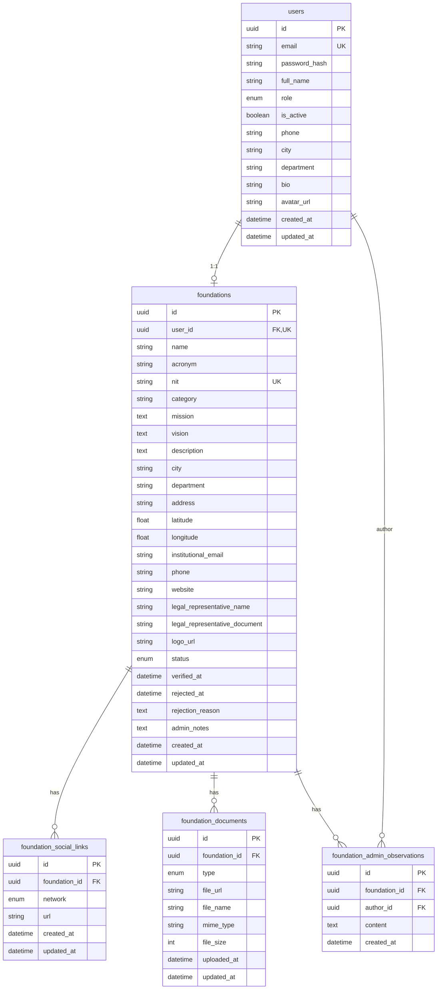

# Base de datos — Ayudandonos Backend

Estado del esquema: **Perfil donante + coordenadas de fundaciones** (sobre Fase 5).

Motor: PostgreSQL. ORM: Prisma.

## Diagrama ER (modulo Fundaciones)

## Enums

### FoundationStatus

| Valor | Uso |
| ----- | --- |
| PENDING | Registro o revision |
| VERIFIED | Visible publicamente |
| REJECTED | Solicitud rechazada |
| SUSPENDED | Suspendida por admin |

### FoundationDocumentType

| Valor | Obligatorio para verificar |
| ----- | -------------------------- |
| RUT | Si |
| LEGAL_EXISTENCE_CERTIFICATE | Si |
| LEGAL_REPRESENTATIVE_ID | Si |
| BANK_CERTIFICATION | No |

### SocialNetworkType

`FACEBOOK`, `INSTAGRAM`, `X`, `LINKEDIN`, `YOUTUBE`, `TIKTOK`, `OTHER`

## Indices

- `foundations`: `status`, `category`, `city`, `department`
- `foundation_admin_observations`: `(foundation_id, created_at)`
- `campaigns`: `foundation_id`, `status`, `start_date`, `end_date`
- `donations`: `donor_user_id`, `status` (stats de donante)

## Migraciones relevantes

| Carpeta | Descripcion |
| ------- | ----------- |
| `20250710180000_foundation_extended_profile` | Schema extendido, enum status, redes y documentos |
| `20250710190000_foundation_acronym_observations` | Sigla (`acronym`) e historial de observaciones admin |
| `20260720190000_campaigns` | Tabla `campaigns` y enum `CampaignStatus` |
| `20260720210000_campaigns_needs_donations` | Needs, Donations, Conversation, Message, historial |
| `20260722010000_notifications` | Tabla `notifications` y enum `NotificationType` |
| `20260722020000_user_profile_fields` | Perfil donante: phone, city, department, bio, avatar_url |
| `20260722030000_foundation_coordinates` | Coordenadas latitude/longitude en fundaciones |

## Extension futura

El modelo de `foundations` y `campaigns` esta disenado para soportar modulos posteriores sin refactor mayor:

- **Storage**: URLs de imagenes/documentos hacia Blob/S3
- **Voluntariado**: perfil de fundacion como ancla organizacional
- **Reportes**: agregaciones por `status`, `category`, `city`, `department`

No eliminar campos de perfil al agregar necesidades; mantener separacion entre identidad organizacional (fundacion) y operacion (campanas).

Catalogo de endpoints: `docs/API_REFERENCE.md`.
