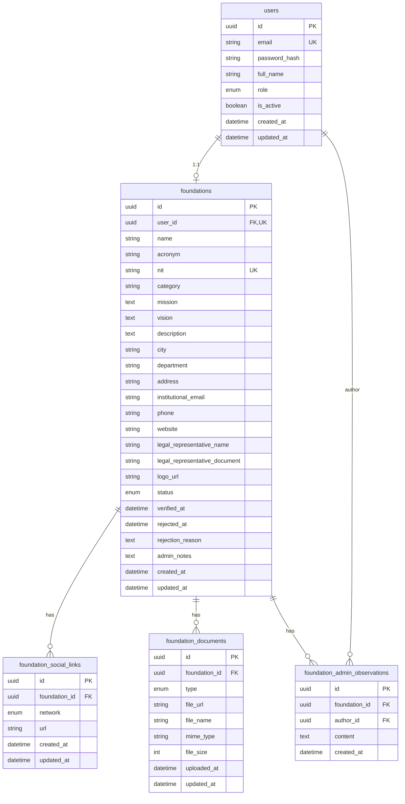

# Base de datos — Ayudandonos Backend

Estado del esquema: **Fase 3 — Fundaciones extendidas**.

Motor: PostgreSQL. ORM: Prisma.

## Diagrama ER (modulo Fundaciones)

## Enums

### FoundationStatus

| Valor | Uso |
| ----- | --- |
| PENDING | Registro o revision |
| VERIFIED | Visible publicamente |
| REJECTED | Solicitud rechazada |
| SUSPENDED | Suspendida por admin |

### FoundationDocumentType

| Valor | Obligatorio para verificar |
| ----- | -------------------------- |
| RUT | Si |
| LEGAL_EXISTENCE_CERTIFICATE | Si |
| LEGAL_REPRESENTATIVE_ID | Si |
| BANK_CERTIFICATION | No |

### SocialNetworkType

`FACEBOOK`, `INSTAGRAM`, `X`, `LINKEDIN`, `YOUTUBE`, `TIKTOK`, `OTHER`

## Indices

- `foundations`: `status`, `category`, `city`, `department`
- `foundation_admin_observations`: `(foundation_id, created_at)`

## Migraciones relevantes

| Carpeta | Descripcion |
| ------- | ----------- |
| `20250710180000_foundation_extended_profile` | Schema extendido, enum status, redes y documentos |
| `20250710190000_foundation_acronym_observations` | Sigla (`acronym`) e historial de observaciones admin |

## Extension futura

El modelo de `foundations` esta disenado para soportar modulos posteriores sin refactor mayor:

- **Campanas**: FK `foundation_id` en tabla futura `campaigns`
- **Necesidades / Donaciones**: relacion via campana o fundacion
- **Voluntariado**: perfil de fundacion como ancla organizacional
- **Reportes**: agregaciones por `status`, `category`, `city`, `department`

No eliminar campos de perfil al agregar campanas; mantener separacion entre identidad organizacional (fundacion) y operacion (campanas).
