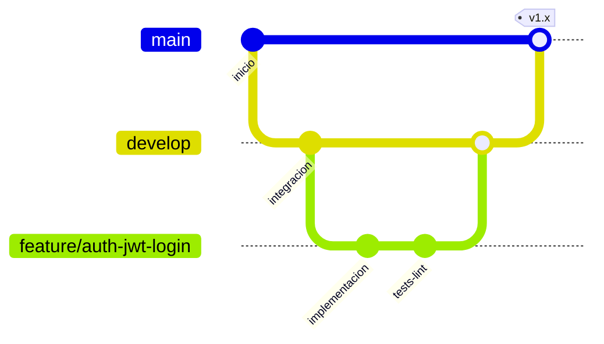

# Flujo Git — Backend Ayudandonos

Estrategia inspirada en **GitFlow**: una rama por tarea, integracion en `develop` y codigo estable en `main`.

## Ramas permanentes

| Rama | Proposito |
| ---- | --------- |
| `main` | Codigo estable y desplegable. Solo recibe merges desde `develop` o `hotfix/*`. |
| `develop` | Integracion de tareas completadas. Rama base para iniciar trabajo diario. |

## Ramas temporales (una por tarea)

| Prefijo | Uso | Base | Merge hacia |
| ------- | --- | ---- | ----------- |
| `feature/` | Nueva funcionalidad o iteracion de fase | `develop` | `develop` |
| `fix/` | Correccion de bug no urgente | `develop` | `develop` |
| `hotfix/` | Correccion urgente en produccion | `main` | `main` y `develop` |
| `release/` | Preparacion de version (opcional) | `develop` | `main` y `develop` |

## Convencion de nombres

Formato: `<prefijo>/<modulo-o-alcance>-<descripcion-corta>`

Ejemplos:

```
feature/auth-jwt-login
feature/users-crud
feature/phase2-database-schema
fix/auth-token-expiration
hotfix/health-endpoint-crash
```

Reglas:

- Minusculas y guiones (`kebab-case`).
- Sin espacios ni caracteres especiales.
- Nombre descriptivo de la tarea, no del desarrollador.

## Flujo por tarea



### 1. Preparar base

```bash
git checkout develop
git pull origin develop
```

### 2. Crear rama de tarea

```bash
git checkout -b feature/nombre-de-la-tarea
```

### 3. Desarrollar

- Commits pequenos y atomicos.
- Formato Conventional Commits (ver `CONTRIBUTING.md`).
- Ejecutar `npm run build` y `npm run lint` antes del PR.

### 4. Publicar y abrir PR

```bash
git push -u origin feature/nombre-de-la-tarea
```

Abrir Pull Request hacia `develop` con:

- Que se hizo y por que.
- Endpoints o modulos afectados.
- Impacto en BD (si aplica).
- Resultado de build y lint.

### 5. Revision y merge

- Revisar codigo (humano o agente segun el caso).
- Merge a `develop` cuando la tarea este aprobada.
- Eliminar la rama remota tras el merge.

### 6. Liberar a main (por fase o version)

Cuando `develop` este estable para una entrega:

```bash
# Opcional: rama release
git checkout -b release/v1.0.0 develop
# Ajustes finales, version, changelog
# PR release -> main y merge back a develop
```

O merge directo `develop` -> `main` si el alcance es una fase completa aprobada.

## Hotfix (urgente en produccion)

```bash
git checkout main
git pull origin main
git checkout -b hotfix/descripcion-corta
# Corregir, build, lint
git push -u origin hotfix/descripcion-corta
# PR -> main; luego merge o cherry-pick a develop
```

## Reglas del equipo

1. **Nunca** commitear directamente en `main` (salvo emergencia acordada).
2. **Una rama = una tarea.** No mezclar varias tareas en la misma rama.
3. Mantener `develop` actualizada antes de crear ramas nuevas.
4. Resolver conflictos en la rama de feature antes del merge.
5. No hacer `push --force` a `main` ni `develop`.
6. Cada PR debe poder revisarse de forma independiente.

## Agentes de IA

Antes de implementar una tarea:

1. Confirmar rama base (`develop`) y nombre de rama con el usuario si no existe.
2. Crear o cambiar a `feature/<tarea>` antes de modificar codigo.
3. No mezclar cambios de tareas distintas en un mismo commit o rama.
4. Indicar en la explicacion desde que rama se trabaja y hacia donde ira el PR.
