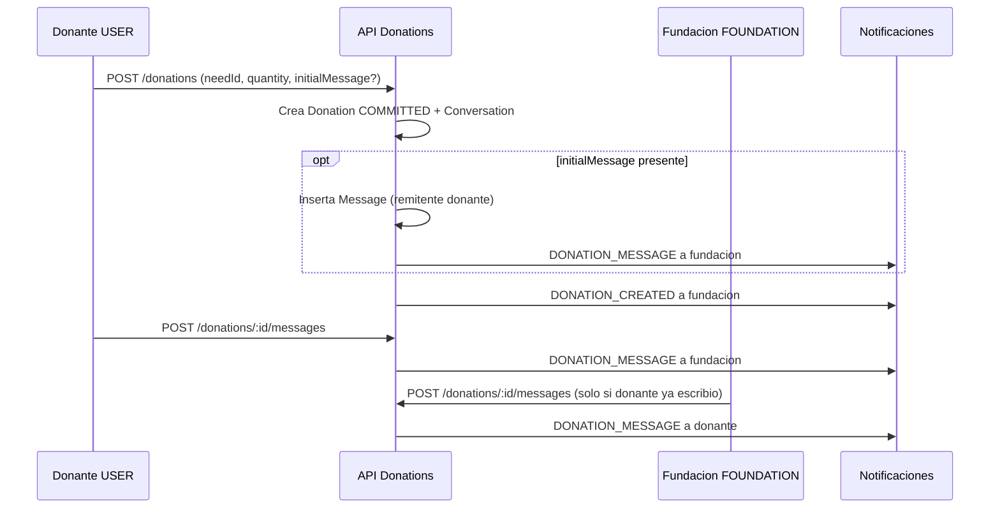

# Modulo de mensajeria — Backend y flujo de producto

Estado: **IMPLEMENTADO** (chat 1:1 por compromiso de donacion).

## Proposito

Permitir comunicacion interna entre **donante** y **fundacion** dentro del contexto de un compromiso de donacion en especie. Cada conversacion queda ligada a una donacion, que a su vez pertenece a una necesidad y campana concretas.

No existe mensajeria libre entre usuarios ni contacto de fundacion antes del compromiso.

## Flujo de negocio



### Reglas obligatorias

| Regla | Implementacion |
| ----- | -------------- |
| El canal se abre al comprometerse | `Conversation` se crea en `POST /donations` |
| Contexto por donacion/campana | `Conversation.donationId` unico; donacion enlaza `need` → `campaign` |
| La fundacion no contacta antes del compromiso | No hay donacion ni conversacion previa |
| La fundacion solo responde | No puede enviar el primer mensaje; debe existir al menos un mensaje del donante (`initialMessage` cuenta) |
| Solo participantes acceden | Donante o usuario de la fundacion duena de la campana (JWT + `assertCanAccessDonation`) |
| Fundacion operativa para responder | `VERIFIED` + perfil, documentos y sede activa completa |
| Bandeja ordenada por actividad | Listados de donaciones ordenados por `conversation.lastMessageAt` |
| Ultimo mensaje y no leidos | Campos en `conversations`; `unreadCount` en DTO de donacion |
| Confirmacion de lectura | `PATCH /donations/:id/messages/read` y auto-marca al listar mensajes |
| Donaciones canceladas | Lectura del historial permitida; envio bloqueado |
| Moderacion basica | Body trim, 1–2000 caracteres (Zod); sin HTML; rate limit global de API |
| Historial persistente | Tabla `messages` ordenada por `createdAt` |
| Notificaciones | `DONATION_MESSAGE` in-app a la contraparte |

## Modelo de datos

### Entidades

```
Campaign 1 ── * Need 1 ── * Donation 1 ── 1 Conversation 1 ── * Message
                     │
                     └── donorUserId → User (donante)
```

### Tabla `conversations`

| Columna | Tipo | Descripcion |
| ------- | ---- | ----------- |
| `id` | UUID PK | Identificador |
| `donation_id` | UUID UNIQUE FK | Una conversacion por donacion |
| `last_message_at` | timestamp nullable | Ultima actividad del hilo |
| `last_message_body` | text nullable | Vista previa del ultimo mensaje |
| `last_message_sender_id` | UUID nullable | Remitente del ultimo mensaje |
| `donor_last_read_at` | timestamp nullable | Lectura del donante |
| `foundation_last_read_at` | timestamp nullable | Lectura de la fundacion |
| `created_at` | timestamp | Apertura del canal |
| `updated_at` | timestamp | Ultima actualizacion |

### Tabla `messages`

| Columna | Tipo | Descripcion |
| ------- | ---- | ----------- |
| `id` | UUID PK | Identificador |
| `conversation_id` | UUID FK | Conversacion padre |
| `sender_id` | UUID FK → users | Remitente autenticado |
| `body` | text | Contenido del mensaje |
| `created_at` | timestamp | Orden cronologico |

Indice: `(conversation_id, created_at)` para listado paginado.

### Relacion con campana

La campana no tiene tabla de mensajes propia. El contexto de campana se obtiene por join:

`Message` → `Conversation` → `Donation` → `Need` → `Campaign`.

## API REST

Base: `/api/v1/donations`

| Metodo | Ruta | Rol | Descripcion |
| ------ | ---- | --- | ----------- |
| `POST` | `/donations` | USER | Crea compromiso, conversacion y opcional `initialMessage` |
| `GET` | `/donations/:id/messages` | Participantes | Lista mensajes (paginado); marca lectura |
| `POST` | `/donations/:id/messages` | Participantes | Envia mensaje |
| `PATCH` | `/donations/:id/messages/read` | Participantes | Marca mensajes como leidos |

Listados `GET /donations/me` y `GET /foundation/requests` incluyen `conversation` con `lastMessageAt`, `lastMessageBody` y `unreadCount`.

### POST `/donations/:id/messages` — body

```json
{ "body": "Puedo llevar los articulos el sabado por la tarde." }
```

### Respuestas de error relevantes

| HTTP | Mensaje | Causa |
| ---- | ------- | ----- |
| 403 | No tienes permiso para acceder a esta conversacion | Usuario ajeno a la donacion |
| 403 | La fundacion solo puede responder despues de que el donante envie el primer mensaje | Fundacion intenta iniciar el hilo |
| 400 | No puedes enviar mensajes en una donacion cancelada | `status === CANCELLED` |
| 404 | Donacion no encontrada | UUID invalido |

## Capas backend

| Capa | Archivo | Responsabilidad |
| ---- | ------- | --------------- |
| Routes | `src/modules/donations/donations.routes.ts` | Swagger, auth, validacion Zod |
| Controller | `donations.controller.ts` | HTTP delegado |
| Service | `donations.service.ts` | Reglas de negocio, notificaciones |
| Repository | `donations.repository.ts` | Prisma: conversacion, mensajes, conteos |
| Validations | `donations.validations.ts` | `createMessageSchema`, `initialMessage` |

## Frontend (repositorio relacionado)

| Ruta | Componente | Rol |
| ---- | ---------- | --- |
| `/foundation/messages` | `FoundationChatsPage` | Bandeja con preview y no leidos |
| `/foundation/messages/:id` | `DonationChatThread` | Hilo de chat fundacion |
| `/my-donations/chats` | `DonorChatsPage` | Bandeja del donante |

Polling de mensajes: 12 segundos (`DonationChatThread`).

## Notificaciones

Ver `docs/NOTIFICATIONS_MODULE.md`. Tipo `DONATION_MESSAGE`:

- Destinatario: la contraparte (donante o usuario de fundacion).
- `linkPath`: `/my-donations/chats/:donationId` (donante) o `/foundation/messages/:donationId` (fundacion).

## Seed y datos demo

En cada `prisma db seed` se crea `conversation` por donacion historica. Ver `docs/SEED.md`.

## Documentacion relacionada

- `docs/API_REFERENCE.md` — seccion Donations / Mensajes
- `docs/DATABASE.md` — migracion `20260720210000_campaigns_needs_donations`
- `docs/NOTIFICATIONS_MODULE.md` — evento `DONATION_MESSAGE`
